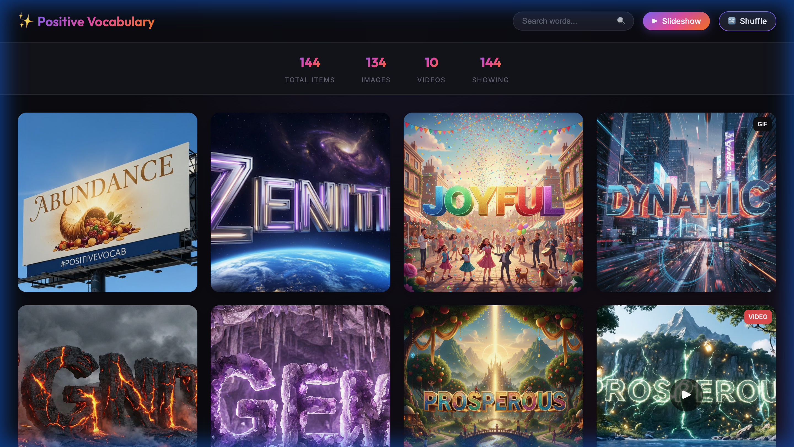

# Positive Vocabulary Gallery

A beautiful, responsive photo gallery website that displays positive vocabulary infographic images with OCR-extracted word metadata.



## Features

- 🖼️ **Responsive Grid Layout** - 4 columns on desktop, adapts to mobile
- 🔀 **Random Shuffle** - Images are shuffled on every page load
- 🎬 **Slideshow Mode** - Full-screen slideshow with autoplay
- 🔍 **Search** - Filter by extracted vocabulary words
- 🎥 **Video Support** - Handles both images and videos
- ⌨️ **Keyboard Navigation** - Arrow keys, Escape, Spacebar
- 📱 **Touch Swipe** - Swipe gestures on mobile
- 🌙 **Dark Theme** - Modern glassmorphism design

## Quick Start

### 1. Install Dependencies

First, install Python dependencies for the OCR preprocessing:

```bash
pip install pytesseract Pillow
```

You also need Tesseract OCR installed on your system:

- **macOS**: `brew install tesseract`
- **Ubuntu/Debian**: `sudo apt install tesseract-ocr`
- **Windows**: [Download installer](https://github.com/UB-Mannheim/tesseract/wiki)

### 2. Run Preprocessing

Generate the metadata.json file:

```bash
python preprocess.py
```

This will scan the `positivevocab/` folder, extract text from images using OCR, and create `metadata.json`.

### 3. View Locally

Start a local server:

```bash
python -m http.server 8000
```

Then open http://localhost:8000 in your browser.

## Deploying to GitHub Pages

1. Push this repository to GitHub
2. Go to **Settings** → **Pages**
3. Select **Source**: Deploy from a branch
4. Select **Branch**: main (or master)
5. Click **Save**

Your gallery will be available at: `https://yourusername.github.io/repositoryname/`

## File Structure

```
photoalbum/
├── positivevocab/       # Your media files (images & videos)
├── preprocess.py        # Python OCR script
├── metadata.json        # Generated metadata (created by script)
├── index.html           # Main webpage
├── styles.css           # Styling
├── app.js               # JavaScript logic
└── README.md            # This file
```

## Controls

### Gallery
- **Click** any item to open slideshow
- **Search** to filter by vocabulary words
- **Shuffle** button to randomize order

### Slideshow
- **←/→** Arrow keys or buttons to navigate
- **Spacebar** Toggle autoplay
- **Escape** Close slideshow
- **Swipe** left/right on mobile

## Customization

### Colors
Edit CSS variables in `styles.css`:

```css
:root {
    --accent-primary: #8b5cf6;       /* Main accent color */
    --accent-gradient: linear-gradient(135deg, #8b5cf6 0%, #ec4899 100%);
    --bg-primary: #0a0a0f;           /* Background color */
}
```

### Grid Columns
Modify the grid in `styles.css`:

```css
.gallery-grid {
    grid-template-columns: repeat(4, 1fr);  /* Change 4 to desired columns */
}
```

## License

MIT License - Feel free to use and modify!
